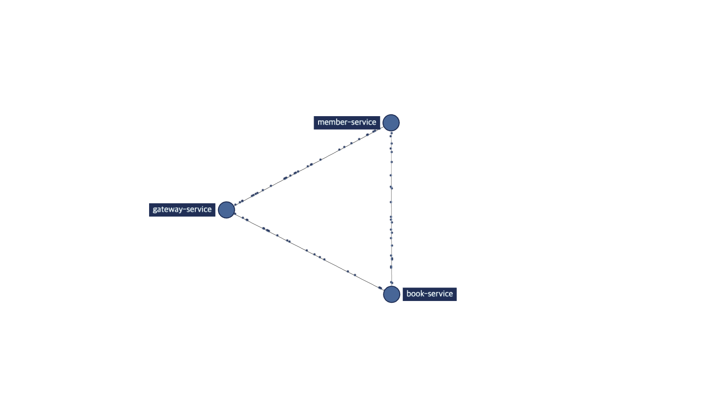

# simple-msa-in-action

* Registration & Discovery
  * [Spring Cloud Netflix(Eureka)](https://cloud.spring.io/spring-cloud-netflix/reference/html/)
* Gateway
  * [Spring Cloud Gateway](https://cloud.spring.io/spring-cloud-gateway/reference/html/)
* Config Server
  * [Spring Cloud Config](https://docs.spring.io/spring-cloud-config/docs/current/reference/html/)
  * Config Changes Monitor & Config 변경사항 전파 
    * [Spring Cloud Bus (Kafka)](https://cloud.spring.io/spring-cloud-bus/reference/html/)
* MicroService To MicroService
  * [Spring Cloud OpenFeign](https://spring.io/projects/spring-cloud-openfeign)
* Tracing
  * [Micrometer, Zipkin](https://micrometer.io/)
  * Spring Boot 3.1까지만 [Spring Cloud Sleuth](https://spring.io/projects/spring-cloud-sleuth) 지원, [Micrometer](https://micrometer.io/)로 이전함
    * [관련자료](https://docs.spring.io/spring-cloud-sleuth/docs/current-SNAPSHOT/reference/html/)
* Composition
  * API Composition
  * CQRS (예정)
* Transaction Management ?
  * Saga Pattern ?
    * Kafka ?
    * Axon ?

### Description
* JDK 21
* Spring Boot 3.2.5
* Kotlin 1.9

---

* Eureka Server (Port : `8761`)
  * Spring Eureka Dashboard : http://localhost:8761
    

    
image

    

      
    

    

* Config Server (Port : `8888`)
  * http://localhost:8888/{application}/{profile}
  * 민감한 정보 처리하게 된다면 암호화 필요
  * ~~파일시스템 활용하여 구축하였지만, git repository로 구축하는 방법도 있음~~
    * github repository 이용하여 구축 완료, 아래 주소는 설정파일이 저장된 repository 주소
    * private repository로 설정 시 접근 관련 설정 필요
    * https://github.com/qoxogus/simple-msa-config
  * 서버별로 `POST | /actuator/refresh`를 호출하는 방법도 있지만, ~~cloud bus를 활용하는 방법도 있음 (여러 서버 config 값을 갱신 시킬 때 유용, kafka etc...)~~
    * cloud bus (kafka) 활용하여 구축 완료
    * [config repository](https://github.com/qoxogus/simple-msa-config)에 webhook 설정하여, 설정 파일 변경 및 push 시 config 서버 `/monitor` 호출 -> 해당하는 서버들에 설정 파일 변경 사항 적용
      * github webhook url 설정은 ngrok 활용 (localhost wrapping)
        * 테스트 할 때 (ngrok)주소 변경 시 webhook에도 변경사항 반영 필요
* Gateway Server (Port : `8000`)
  * http://localhost:8000/api/v1/health-check
* Member Server (Port : `8080`)
  * http://localhost:8080/api/v1/members/health-check
  * for gateway : http://localhost:8000/api/v1/members/health-check
    * predicate : `/api/{version}/members/**`
    * forward : `8000` -> `8080`
* Book Server (Port : `9090`)
  * http://localhost:9090/api/v1/books/health-check
  * for gateway : http://localhost:8000/api/v1/books/health-check
    * predicate : `/api/{version}/books/**`
    * forward : `8000` -> `9090`

---

* [Docker Compose] Kafka & Zookeeper Server (Port : `29092`)
  * Kafka Server (Port : `29092`)
  * Zookeeper Server (Port : `22181`)
  * cloud bus 용도로 활용
  * [docker compose yml setting](docker/kafka/docker-compose.yml)
* [Docker] Zipkin Server (Port : `9411`)
  * Brave + Zipkin 구성으로 적용 (+ OpenFeign Micrometer)
  * [zipkin starter (sh)](docker/zipkin/zipkin-starter.sh)
  * http://localhost:9411/zipkin

  *service structure image*